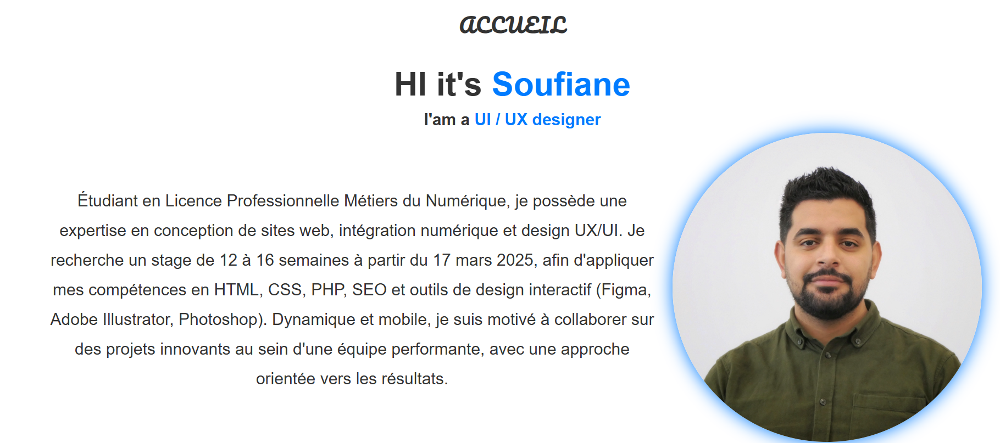

# 🖥️ Portfolio CV - Soufiane Bouabid

Bienvenue dans mon projet de **Portfolio CV** interactif, développé avec passion en **HTML**, **CSS** et **JavaScript** ! 🌟

## 🌟 Fonctionnalités principales
- 🧑‍💻 **Section À propos** : Une présentation personnelle et mes objectifs professionnels.
- 🗂️ **Portfolio** : Une galerie de projets réalisés avec des détails et des liens interactifs.
- 📩 **Contact** : Un formulaire élégant pour faciliter la prise de contact.
- 📱 **Responsive Design** : Un site adapté à tous les appareils (desktop, tablette, mobile).

## 🎯 Objectif
Créer une plateforme attrayante et intuitive qui reflète mes compétences en **design web** et **développement front-end**.

## 🚀 Technologies utilisées
- **HTML5** : Structure du site.
- **CSS3** : Mise en page et design responsive.
- **JavaScript** : Interactivité et animations.

## ✨ Aperçu



## 📂 Installation
1. Clonez ce repository :
   ```bash
      git clone https://github.com/votre-utilisateur/votre-repo.git
   
2. *Ouvrir le site*
   - Ouvrez le fichier index.html dans votre navigateur préféré pour afficher le portfolio.
   - Ou utilisez un serveur local comme Live Server dans VS Code.

3. *Accéder au site*
   - Ouvrez votre navigateur.
   - Visitez http://localhost:5501 ou selon la configuration de votre serveur local.

## 🌐 Version en Ligne

[soufiane04-bouabid](https://soufiane04-bouabid.github.io/)


## 📬 Contact
💌 Vous souhaitez me joindre ? Voici mes coordonnées :

 - **LinkedIn :** linkedin.com/in/soufiane-bouabid
 - **Email :** soufianebouabids@gmail.com
 - **Téléphone :** 0617834842 📞
 
 
 ## ⭐ Vos retours sont précieux ! N'hésitez pas à me contacter pour toute remarque ou collaboration. ⭐
